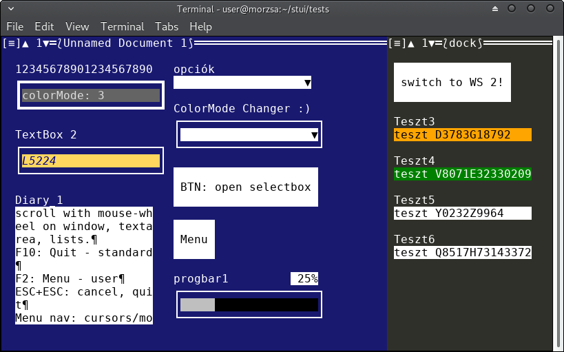
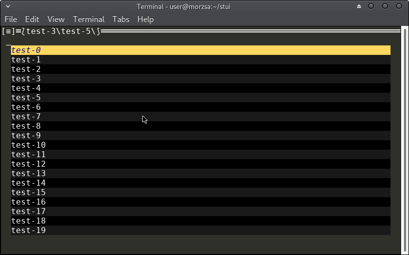
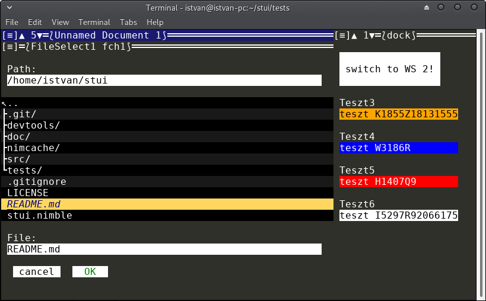

# stui
### Simplified Terminal UI (Nim lang, ANSI terminal) 

This is my first app in Nim - it covers pretty much anything i need to learn.

**STUI is a drag&drop aware, responsive layout, themeable, ANSI terminal UI.**

branches:
* master: usable alpha, revised for nim v0.19, devel

releases:
* nim 0.18 version archived as release

Status: usable alpha. missing: widgets, banners, splash; docs, cleanup
  see: stui_test1.nim  
  copy&use: template_simpleapp.nim  

Please help the development with your feedback. :)

It can Tile the screen vertically, 
Tiles can have relative "50%" or exact "100ch" width.

Windows are filling the Tile, and cascade over each other, 
covering each other fully - only titlebar visible ("breadcrumbs like")
Windows cannot be moved, etc.

Controlls layout is automatically computed - from top to bottom, left to right.
Controlls can have relative or exact width / heigth
or manually if Controll.recalc() is added then it sets x1,x2,y1,y2,width,heigth.

Terminal resize is watched in every 2 secs - on resize layout recalculated.

STUI can handle more screens - **WorkSpaces**  

  **tree: App->WorkSpaces->Tiles->Windows->(Pages->)Controlls**  

  PageBreak is not inserted into pages.controlls[]  

It can be **themed** with parseCfg compatible files *(.TSS)* style sheets

**Event listeners: Observer style:**  

    Listener = tuple[name:string, actions: seq[proc(source:Controll):void]]

    ListenerList = seq[Listener]

    proc addEventListener*(controll:Controll, evtname:string, fun:proc(source:Controll):void)

    proc removeEventListener*(controll:Controll, evtname:string, fun:proc(source:Controll):void)

    proc trigger*(controll:Controll, evtname:string )

    e.g.:
        selectbox2.addEventListener("change", changeColorMode)

        proc changeColorMode(source:Controll)=
        discard parseInt(sb2.value, source.app.colorMode)
        source.app.draw()

**Demo / test file is stui_test1.nim** - use F10 or 2x ESC to Quit

**App template: template_simpleapp.nim**

**Dependency: like Deja-Vu TTF - a font with large unicode character set**

* ui_textbox: text input, 1 line heigh
* ui_button: .
* ui_textarea: multi line textbox, editable, scrollable
* ui_menu: full screen hierarchial menu - breadcrumbs in window
* ui_stringlistbox: like a listbox, items having actions, not for (multi)selection
* ui_progressbar
* ui_fineprogressbar: uses unicode block characters; can be colored by level (normal, warn, err)
* ui_selectbox: (multi) selectbox
* **ui_fileselect: <NEW><DEVEL>**

**Demo / test file is stui_test1.nim**

    Default Keyboard Shortcuts:
        F2: menu TODO
        F5: refresh screen
        F9: menu TODO
        F10: quit app

        TAB: - add focus to next gui Controll; 
             - commit changes to Controll (e.g.:TextArea)

        ESC and ESC again: cancel editing, quit app

        PgUP/PgDown: on Window -> change Page; on TextArea: "scroll"

    Mouse:
        Wheel "Scrolls": Window->Page; TextArea

  
  
  

  [on colors](doc/Colors.md)  
  [on Controll](doc/Controlls.md)  

I think, that even if i go back to my IOT projects, 
it is an easy to maintain, extend, dependency free project.

